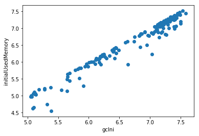
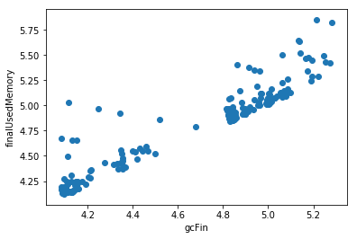
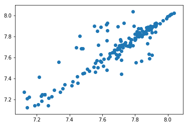
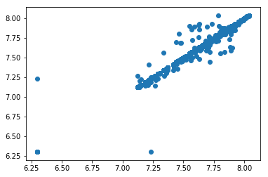
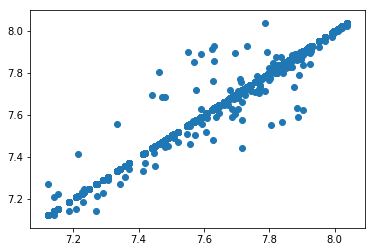

<h1 align="center">
GS-Quantify-17
</h1>

<h2 align="center">
(Goldman Sachs Flagship Data Science Competition)
</h2>

  
  
  
  

 
 

## ML Problem Statement - Predicting Garbage Collector Invocation

## Data Visualisation

Here `gc` stands for Garbage Collector.

   
  <b> initial-Used-Memory (y-axis) vs gc-Initial-Memory (x-axis)</b>

The plot shows us that there is a linear relationship between the 2 variabes.

   
  <b> Final-Used-Memory vs gc-Final-Memory</b>

The plot shows us that there is a linear relationship between the 2 variabes.

   
  <b> initial-Used-Memory + initial-Free-Memory  vs gc-Total-Memory</b>

The plot shows us that there is a linear relationship between the 2 variabes.

   
  <b> initial-Used-Memory + initial-Free-Memory  vs final-Used-Memory + final-Free-Memory </b>

The plot shows us that there is a linear relationship between the 2 variabes. We observe 3 outliers in this plot which we remove before proceeding.

   
  <b> initial-Used-Memory + initial-Free-Memory  vs final-Used-Memory + final-Free-Memory </b>

The plot shows us that there is a linear relationship between the 2 variabes.

## Approximations Used
Following approximations were made:
* gcInitialMemory = initialUsedMemory
* GcFinalMemory = finalUsedMemory
* GcTotalMemory = finalUsedMemory+finalFreeMemory = initialUsedMemory + initialFreeMemory

We were required to print the memory free after every query is served but he heading of that column was given as initialFreeMemory which we take it as finalFreeMemory

## Models Used

* **Linear Regression**
Following the plots and approximations we predicted:
  * gcInitialMemory using linear regression with initialUsedMemory
 
  * finalUsedMemory using linear regression with resources+initialUsedMemory
 
  * gcTotalMemory using linear regression with initialUsedMemory+initialFreeMemory
 
  * FinalFreeMemory using linear regression with initialFreeMemory+initialUsedMemory-finalUsedMemory
 
 

* **XGBOOST**

  Xgboost was used to determine the **gcRun**. We gave parameters to xgboost as: **resources**, **initialMemoryUsed**,         **initialMemoryFree**, **cpuTimeTaken**.

  We chose this model as the output was not in linearly related to the parameters. We confirmed this creating a cross validation set and checking the accuracy of a linear model such as logistic regression, linear SVM( both hard-margin and soft-margin). The result came to be very poor. We also tried SVM with ‘rbf’ kernel, which wasn’t much an improvement from the linear models. 

  So we applied Xgboost was the best among the other models due to the nonlinear relationship between taget and parameters. Xgboost being an ensemble method has the added advantage of not being overfitted easily while preserving the accuracy.  

## Strategy for deciding the results
To predict **gcRun**:

We used the xgboost to predict ‘gcRun’. We supplied **resources** feature to the xgboost algorithm by saved value of resources that we obtained from the training set. Eg: token_53 had ‘resources’ as 0.047545312750000325 which was obtained from training set.

To predict **initialFreeMemory**:

* We computed initialFreeMemory as previous query’s finalFreeMemory
* We computed initialUsedMemory as previous query’s finalUsedMemory
* We computed gcInitialMemory as initialFreeMemory of same query
* We computed gcTotalMemory as initialFreeMemory+initialUsedMemory of same query
* We computed finalUsedMemory as resources+initialUsedMemory of same query
* We computed finalFreeMemory as initialFreeMemory+initialUsedMemory-finalUsedMemory of same query

This finalFreeMemory then becomes the output for that query as the initialFreeMemory

 
 

## Github repos of similar Data Science Competitions:

* [Analyze-This-18](https://github.com/ekagra-ranjan/Analyze-This-18)
* [Analyze-This-17](https://github.com/ekagra-ranjan/Analyze-This-17)
* [Inter-IIT-Techmeet-17](https://github.com/ekagra-ranjan/Optimal-Bidding/)

	Please star the repo if you found the materials in the repo useful :)

